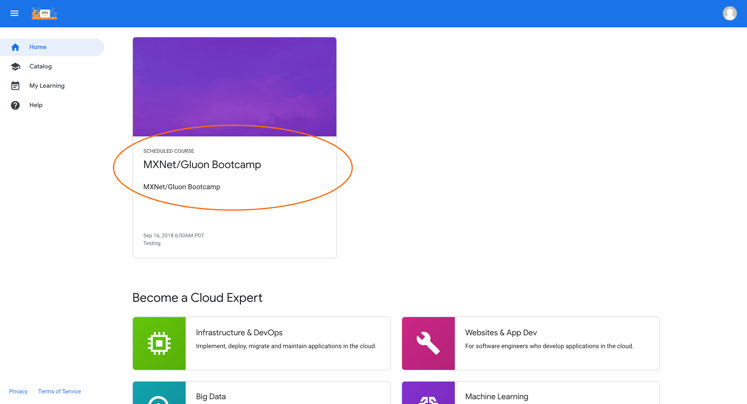
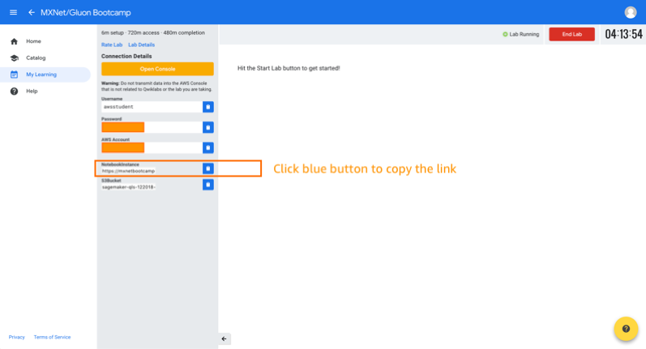
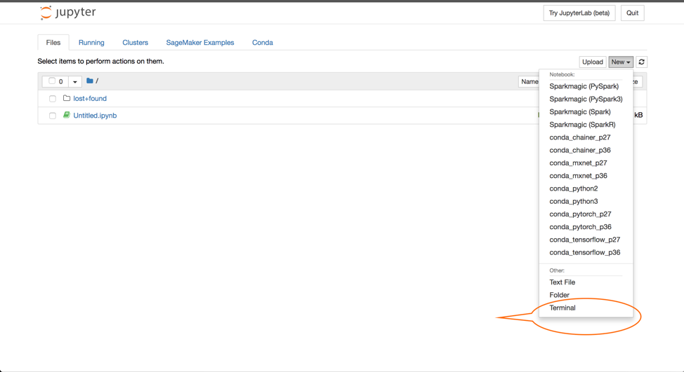
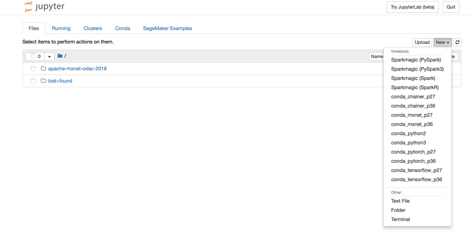

# QWIKLab Instructions


Welcome to Apache MXNet Seminar. We will use Amazon SageMaker to run the Apache MXNet lab sessions.

1.	Go to [https://events-aws.qwiklabs.com/](https://events-aws.qwiklabs.com/) and create an account.
2.	Send the email-id, with which you registered in qwiklabs, to
**khedia@amazon.com**  (Your QWIKLab account will be added to the student list in the lab. This will essential to get access to the lab.)
3.	Once you login to QwikLabs, click on the MXNet/Gluon BootCamp Lab
    

4. Once inside the lab, use the Notebook Instance and the credentials (Account ID, User Name, Password) provided to login to Amazon SageMaker jupyter notebook.
    

5. We will download the lab material to use on the notebook, start a new terminal session on SageMaker.
    

6. Clone the github repo recursively – it contains an assortment of material used in this workshop.
    ```IITKGP_MXNet_talk
    git clone https://github.com/ankkhedia/IITKGP_MXNet_talk ~/SageMaker/IITKGP_MXNet_talk
    ```

7. Now we can access the material from the notebook instance and run through the exercises by going into the `IITKGP_MXNet_talk` directory.

8. Choose mxnet_p36 conda environment as the Kernel when executing a notebook.


You are all set! Let's get started...
